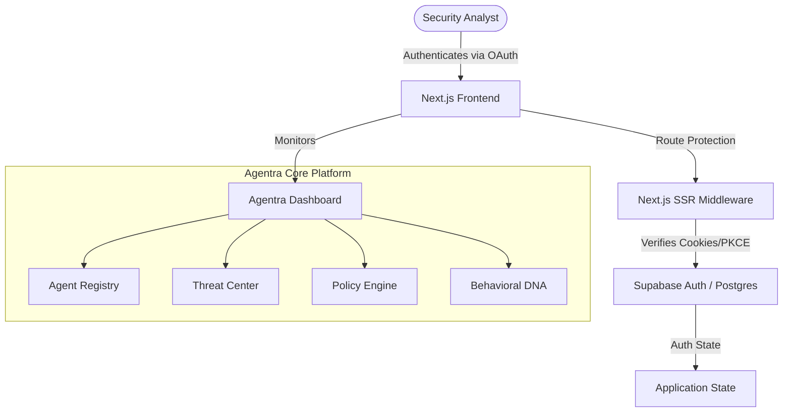

# Agentra 🛡️
🏆 **Created for Microsoft Build AI 2026 Hackathon**
*Secure Intelligence for Autonomous Agents via Zero-Trust Architecture*

  

[Launch Live Dashboard](https://agentra-azure.vercel.app/) &nbsp;&nbsp;&nbsp;|&nbsp;&nbsp;&nbsp; [Access Documentation](#)

## 📊 Telemetry System Architecture
The diagram below maps the dynamic telemetry cycle, showing how raw agent operations sync to the control plane and reflect live in the Next.js Dashboard:



## 📂 Project Directory Structure
```text
Agentra/
├── app/                     # Next.js App Router (Frontend Dashboard & Auth)
│   ├── auth/                # Supabase SSR Login & Google OAuth handling
│   └── dashboard/           # Protected routes for Agent Monitoring
├── components/              # Reusable UI components & Cyber Aesthetics
│   ├── cyber/               # Custom glassmorphic / animated components
│   └── ui/                  # Base Radix UI components
├── lib/                     # SDKs, Contexts, and Utilities
│   ├── auth-context.tsx     # Global Authentication State
│   └── supabase.ts          # Supabase Browser Client Config
├── middleware.ts            # Edge middleware for Zero-Trust routing
├── package.json             # NPM dependencies
└── README.md                # This manual
```

## ⚙️ Prerequisites
- Node.js (v18.0.0 or higher)
- Git
- A free [Supabase](https://supabase.com/) Account

## 🚀 Step 1: Initialize Supabase DB
Sign up for a free database project at Supabase.
Open the SQL Editor in your Supabase dashboard and run the query below to construct the tables for your Agentra Security Registry:

```sql
-- Create database tables
CREATE TABLE agents (
  id TEXT PRIMARY KEY,
  name TEXT NOT NULL,
  type TEXT NOT NULL,
  status TEXT DEFAULT 'Offline',
  trust_score INT DEFAULT 100,
  risk_level TEXT DEFAULT 'Low',
  last_action TEXT
);

CREATE TABLE threats (
  id UUID PRIMARY KEY DEFAULT gen_random_uuid(),
  agent_id TEXT REFERENCES agents(id) ON DELETE CASCADE,
  threat_type TEXT,
  description TEXT,
  severity TEXT,
  timestamp TIMESTAMPTZ DEFAULT NOW()
);

CREATE TABLE policies (
  id TEXT PRIMARY KEY,
  name TEXT NOT NULL,
  description TEXT,
  enforcement_level TEXT DEFAULT 'Strict'
);

-- Seed default agents
INSERT INTO agents (id, name, type, status, trust_score, risk_level, last_action) VALUES
('agent-sec-01', 'Security Copilot', 'Threat Analysis', 'Active', 100, 'Low', 'System standby'),
('agent-dev-02', 'Dev Copilot', 'Code Generation', 'Offline', 100, 'Low', 'System standby'),
('agent-data-03', 'Data Warden', 'Database Integrity', 'Active', 95, 'Medium', 'Analyzing logs');

INSERT INTO policies (id, name, description, enforcement_level) VALUES
('pol-01', 'Zero Trust Isolation', 'Automatically sandbox agents with trust scores below 50.', 'Strict'),
('pol-02', 'Data Exfiltration Guard', 'Block unauthorized external network requests.', 'Strict');
```

## 💻 Step 2: Running Locally

**1. Clone & Install**
```bash
git clone https://github.com/AyaanB24/Agentra.git
cd Agentra/Agentra
npm install
```

**2. Configure Environment Keys**
Create a file named `.env.local` inside the root folder with your Supabase tokens:

```env
NEXT_PUBLIC_SUPABASE_URL=https://your-supabase-project.supabase.co
NEXT_PUBLIC_SUPABASE_ANON_KEY=your-supabase-anon-key
```
*(Never commit this `.env.local` file to Git—it is ignored automatically by our `.gitignore` to keep credentials secure!)*

**3. Run the Next.js Client**
```bash
npm run dev
```
Open [http://localhost:3000](http://localhost:3000) in your browser.

## ☁️ Step 3: Cloud Deployment
- **Frontend**: Deployed on Vercel pointing to the `Agentra` root folder. Environment variables `NEXT_PUBLIC_SUPABASE_URL` and `NEXT_PUBLIC_SUPABASE_ANON_KEY` are entered securely in the Vercel Dashboard.
- **Database**: Hosted securely on Supabase, leveraging PostgreSQL Row Level Security (RLS).

## 🔒 Security Architecture FAQ (Is this configuration safe?)
**Question**: Does putting our live Vercel Dashboard link directly in the README create a security vulnerability?

**Answer**: No, it is 100% secure. Here is why:
- **No Secret Exposures**: All private database server passwords, Google API credentials, and Azure OpenAI keys are stored securely as environment variables inside Vercel's and Supabase's admin panels. They are never committed to GitHub.
- **Public Keys are Safe**: Supabase's Client URL and Anon Key (`NEXT_PUBLIC_...`) are designed to be public. Supabase secures the database tables using Row Level Security (RLS) policies inside PostgreSQL. Anyone can see the URL, but they cannot read or write data unless they successfully authenticate.
- **Strict Middleware**: The Next.js edge `middleware.ts` strictly enforces that unauthenticated users can never access the dashboard routes.

## 🛠️ Mitigations & Simulation Tests
- **Onboarding**: Click *Initialize Security System*, register a new account, or use *Continue with Google* to instantly log in as a Security Analyst.
- **Demo Bypass Mode**: Judges and reviewers can click *Launch Demo Mode* on the authentication page to instantly bypass the login screen using a secure, temporary browser cookie without needing to create an account.
- **Zero-Trust Dashboard**: Once authenticated, the dashboard will display the live Swarm Topology, highlighting active agents and real-time threat telemetry.

## 👥 Authors & Credits
Crafted with 🛡️ by **Ayaan & Asiya**. Created for **Microsoft Build AI 2026 Hackathon**.
